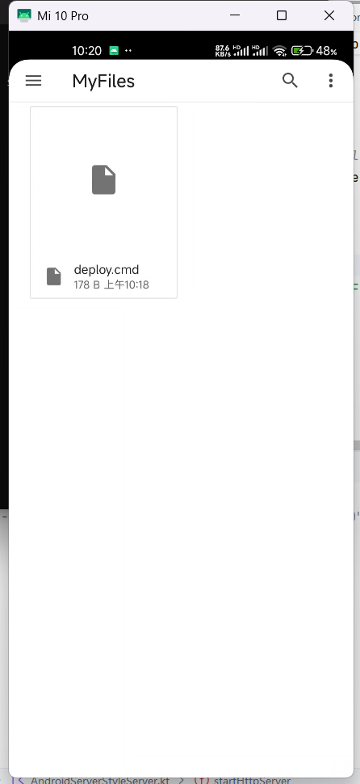

# build guide

# build with importing andresguard
- .\gradlew resguardRelease
- .\gradlew resguardDebug # this for debug, works for me
# todo
1. [v] make bottom tabbar
3. fix andserver style code

# screenshot
- 文件上传到手机
